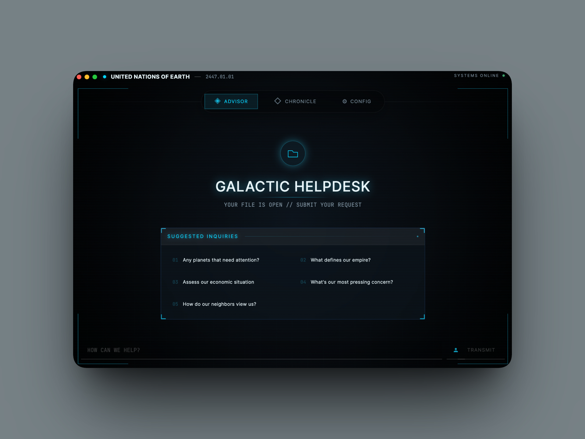

# Stellaris LLM Companion

[](LICENSE)
[](https://github.com/gitmaan/stellaris-companion/actions/workflows/rust-parser.yml)
[](https://github.com/gitmaan/stellaris-companion/actions/workflows/python.yml)
[](https://www.python.org/downloads/)
[](https://rustup.rs/)

Your empire's strategic council, on demand.

Stellaris LLM Companion reads your save, tracks what is changing across time, and gives actionable strategic advice in your empire's voice. It uses Gemini 3 Flash (`gemini-3-flash-preview`) and a Rust parser for fast extraction.



## Why use it

- **Actionable strategy, not generic tips**: Military, economy, diplomacy, leaders, planets, tech, and more.
- **Chronicle mode**: Turn your campaign into a narrative history with chaptered events.
- **In-game workflow**: Ask questions through Discord overlay with `/ask` while you play.
- **Privacy-first architecture**: Saves stay local. You bring your own API key.

## Quick Start (Recommended)

### Requirements

- **Python 3.10+**
- **Rust toolchain** (required for `stellaris-parser`)
- **Node.js** (for Electron app)
- **Gemini API key** from [Google AI Studio](https://aistudio.google.com/)

### Run the app

```bash
cd ~/stellaris-companion

# Python deps (declared in pyproject.toml)
python3 -m venv venv
source venv/bin/activate
pip install .

# Build Rust parser (required)
cd stellaris-parser && cargo build --release && cd ..

# Install Electron deps
npm -C electron install
npm -C electron/renderer install

# Run backend + desktop app
./dev.sh
```

### Add your API key

For development, use `.env`:

```bash
echo 'GOOGLE_API_KEY="your-key-here"' > .env
```

For packaged builds, paste it in **Config** -> **INTELLIGENCE UPLINK**.

## What you can ask

- "Give me a strategic briefing"
- "Who should I be worried about right now?"
- "What is hurting my economy?"
- "Should I push alloys or research this decade?"
- "How strong is my military compared to neighbors?"
- "Which tech path gives me the biggest edge next?"

## Core Features

- **Fast Chat**: Uses a precomputed complete briefing JSON (no tool-calling loop).
- **Deep Extraction Coverage**: Military, economy, diplomacy, leaders, planets, starbases, technology.
- **Dynamic Personality**: Advisor tone adapts to ethics, government, and civics.
- **History Tracking**: SQLite snapshots detect change between saves.
- **Chronicle**: AI-generated chaptered narrative from your campaign history.
- **Auto Save Detection**: Finds your newest save automatically.
- **Discord Integration**: Ask `/ask` in-game through Discord overlay.

## Privacy (Plain English)

- **Your `.sav` files stay on your machine.**
- **Local processing by default**: parsing, extraction, and history storage are local.
- **What leaves your machine**: your question + extracted game context are sent to Gemini using your own key.
- **Discord relay scope**: relay forwards `/ask` requests/responses between Discord and your local app.
- **Issue reports are opt-in**: you review what is included before submitting.

## Optional: Discord Overlay Setup

1. Open the Electron app and go to **Config**.
2. Click **CONNECT DISCORD** and authorize in your browser.
3. Click **INVITE BOT** to add `/ask` to your server (first time only).
4. Open Discord overlay in-game and run:

```text
/ask Should I attack the fallen empire?
/ask What's my economy looking like?
/ask Who should I be worried about?
```

The Electron app must be running for Discord commands to work.

For relay self-hosting and maintainer setup, see `cloudflare/README.md`.

## Save File Locations

Auto-detected defaults:

- **macOS**: `~/Documents/Paradox Interactive/Stellaris/save games/`
- **Linux (Steam)**: `~/.local/share/Paradox Interactive/Stellaris/save games/`
- **Linux (Flatpak Steam)**: `~/.var/app/com.valvesoftware.Steam/.local/share/Paradox Interactive/Stellaris/save games/`
- **Windows**: `Documents\\Paradox Interactive\\Stellaris\\save games\\`

You can always override the folder in **Config**.

For GeForce Now / cloud gaming, download your `.sav` from Steam Remote Storage and point **Config** -> **DATA INGESTION** -> **BROWSE** to that folder.

## How It Works

```text
User Question
     |
     v
Gemini 3 Flash + empire-specific personality
     |
     v
Complete Briefing JSON (precomputed + cached)
     |
     v
Strategic response
```

Main interfaces:

- **Electron app**: primary UI for chat, chronicle, history, settings.
- **Discord**: in-game `/ask` routed through Cloudflare relay to your local app.

## Perspective & Spoilers

Currently, the companion runs in a **Strategic Perspective**. Most outputs are
player-centric (your empire, your economy, your wars, and your known contacts),
but some systems use galaxy-wide signals for stronger analysis. In practice,
this can occasionally surface information earlier than normal in-game discovery.

A stricter **Immersive Perspective** with fog-of-war-aware filtering is planned
as a future exploration area.

## Rust Parser (`stellaris-parser`)

The Rust parser is required. It is built on [jomini](https://crates.io/crates/jomini) and is significantly faster than regex-style parsing for large saves.

Pre-built binaries are published via [GitHub Releases](https://github.com/gitmaan/stellaris-companion/releases). The local `bin/` directory is used for packaging/manual placement.

Build from source:

```bash
cd stellaris-parser
cargo build --release
# Binary: stellaris-parser/target/release/stellaris-parser
```

Example CLI usage:

```bash
./stellaris-parser/target/release/stellaris-parser extract-save test_save.sav --sections meta,galaxy --output -
./stellaris-parser/target/release/stellaris-parser iter-save test_save.sav --section country --format jsonl
```

Python integration is automatic via `stellaris_companion.rust_bridge`.

## Development

Helpful docs:

- `docs/architecture.md` - Three-process architecture overview
- `docs/ipc-contract.md` - IPC response envelope specification
- `docs/dev-workflow.md` - Development workflow guide
- `docs/RUST_PARSER_ARCHITECTURE.md` - Rust parser CLI + session IPC contract

Useful commands:

```bash
ruff check .
ruff format --check .
pytest tests/ -v --tb=short
npm -C electron/renderer run build
```

## Project Structure

```text
stellaris-companion/
├── electron/                     # Desktop app (React + Electron)
├── backend/                      # Python backend (FastAPI)
├── cloudflare/                   # Discord relay worker
├── workers/stellaris-feedback/   # Optional feedback worker
├── stellaris_companion/          # Shared Python runtime package
├── stellaris_save_extractor/     # Extraction logic and domains
├── stellaris-parser/             # Rust parser
├── scripts/                      # Build/dev scripts
├── docs/                         # Architecture docs
├── tests/                        # Test suite
└── pyproject.toml
```

## Contributing

See `CONTRIBUTING.md`.

## License

MIT
