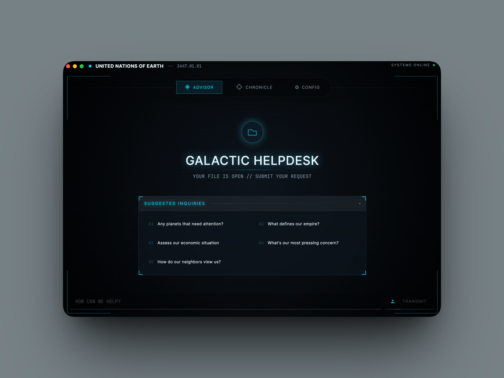

# Stellaris LLM Companion

[](LICENSE)
[](https://github.com/gitmaan/stellaris-companion/actions/workflows/rust-parser.yml)
[](https://github.com/gitmaan/stellaris-companion/actions/workflows/python.yml)
[](https://www.python.org/downloads/)
[](https://rustup.rs/)

Your empire's strategic council, on demand.

Stellaris LLM Companion reads your save, tracks what is changing across time, and gives actionable strategic advice in your empire's voice. Gemini is the default, with Ollama, LM Studio, OpenRouter, and custom OpenAI-compatible endpoints also supported for both Advisor and Chronicle.



## Why use it

- **Actionable strategy, not generic tips**: Military, economy, diplomacy, leaders, planets, tech, and more.
- **Chronicle mode**: Turn your campaign into a narrative history with chaptered events.
- **Local AI app access**: Use the MCP Relay to bring your current campaign context into Claude Desktop, Codex, and other MCP-compatible clients.
- **In-game workflow**: Ask questions through Discord overlay with `/ask` while you play.
- **Privacy-first architecture**: Saves stay local. You bring your own API key.

## Quick Start (Recommended)

### Requirements

- **Python 3.10+**
- **Rust toolchain** (required for `stellaris-parser`)
- **Node.js 22.12+** (for Electron app)
- **Gemini API key** from [Google AI Studio](https://aistudio.google.com/) when Gemini is selected

### Run the app

```bash
cd ~/stellaris-companion

# Python deps (declared in pyproject.toml)
python3 -m venv venv
source venv/bin/activate
pip install .

# Build Rust parser (required)
cd stellaris-parser && cargo build --release && cd ..

# Install Electron deps
npm -C electron install
npm -C electron/renderer install

# Run backend + desktop app
./dev.sh
```

### Connect your AI

Open **Config** → **AI SETUP**, or follow the first-run setup:

- **Gemini:** create a key in [Google AI Studio](https://aistudio.google.com/app/apikey), paste it, and choose **Check and save**. Model selection is automatic.
- **OpenRouter:** choose **Online provider**, connect in your browser, select a model, and choose **Check and save**. Model costs are shown before you save; provider credits may be required.
- **Ollama or LM Studio:** start the local app, load a model, and enable its server. Choose **On this device**, find models, select one, and choose **Check and save**.
- **Custom:** enter a compatible API URL and optional key under **Online provider**. Advanced settings accept a model ID directly.

The selected provider powers both Advisor and Chronicle. Setup checks use a small sample request without campaign data. For local models, use a context window of at least 32K tokens for full campaign briefings.

To use an existing AI app instead, choose **I already use an AI app** and follow the [connection guide](docs/local-mcp.md). This lets you discuss your campaign in that app; in-app Advisor and Chronicle still need a provider. Chat subscriptions and API billing are separate.

For development, set `GOOGLE_API_KEY` in `.env` or use the same setup screen.

## What you can ask

- "Give me a strategic briefing"
- "Who should I be worried about right now?"
- "What is hurting my economy?"
- "Should I push alloys or research this decade?"
- "How strong is my military compared to neighbors?"
- "Which tech path gives me the biggest edge next?"

## Core Features

- **Fast Chat**: Uses a precomputed complete briefing JSON (no tool-calling loop).
- **Deep Extraction Coverage**: Military, economy, diplomacy, leaders, planets, starbases, technology.
- **Dynamic Personality**: Advisor tone adapts to ethics, government, and civics.
- **History Tracking**: SQLite snapshots detect change between saves.
- **Chronicle**: AI-generated chaptered narrative from your campaign history.
- **Auto Save Detection**: Finds your newest save automatically.
- **MCP Relay**: Connect Claude Desktop, Claude Code, Codex, Cursor, LM Studio, and other MCP-compatible local AI apps to the latest campaign context.
- **Discord Integration**: Ask `/ask` in-game through Discord overlay.

## Privacy (Plain English)

- **Your `.sav` files stay on your machine.**
- **Local processing by default**: parsing, extraction, and history storage are local.
- **What leaves your machine**: Advisor questions, Chronicle prompts, and extracted game context are sent to the provider and model you select. Ollama and LM Studio connect through local loopback addresses by default, but Ollama cloud models process prompts remotely. OpenRouter and custom remote endpoints receive that context over the network.
- **One selected AI provider**: The same provider and model power Advisor and in-app Chronicle generation; existing Chronicle chapters remain readable when that provider is offline.
- **MCP client access**: configured local AI apps can read the extracted campaign cache through the MCP Relay.
- **Chronicle write-back**: MCP clients can save Chronicle edits only through explicit Chronicle save/update tools, and those edits stay in the local Chronicle cache.
- **Discord relay scope**: relay forwards `/ask` requests/responses between Discord and your local app.
- **Issue reports are opt-in**: you review what is included before submitting.

## Optional: Local AI Apps / MCP Relay

Stellaris Companion can expose your current campaign context to local AI apps through the Model Context Protocol (MCP). This lets tools like Claude Desktop, Claude Code, Codex, Cursor, LM Studio, and other MCP-compatible clients answer questions using the same local campaign archive as the desktop app.

What the MCP Relay provides:

- **Advisor context**: active campaign status, strategic briefings, economy, military, diplomacy, territory, technology, and recent events.
- **Chronicle context**: saved Chronicle chapters and source material for drafting new campaign prose.
- **Chronicle save-back tools**: optional local save/update/create/undo actions for Chronicle text after you explicitly ask the AI client to save changes back to Stellaris Companion.

Setup:

1. Open Stellaris Companion and load or select your Stellaris save folder.
2. Let the app ingest at least one campaign snapshot.
3. Go to **Config** -> **AI APP CONNECTIONS**.
4. Choose **Claude Desktop**, **ChatGPT + Codex**, or **Cursor**, then click **CONNECT**. Stellaris Companion preserves the rest of that client's MCP configuration and creates a backup before changing JSON config files.
5. Restart the AI app if it is already open. The connection and campaign readiness checks run automatically when you return to Settings.
6. For another MCP-compatible client, open **SHOW MANUAL MCP SETUP** and copy the generic configuration. The same section also provides sanitized diagnostics and a manual health check.

The MCP Relay reads the app's local campaign cache without exposing provider API keys or raw save files. It checks edits against the latest Chronicle to prevent overwrites and supports undoing the latest external edit. See [local MCP integration](docs/local-mcp.md) for details.

## Optional: Discord Overlay Setup

1. Open the Electron app and go to **Config**.
2. Click **CONNECT DISCORD** and authorize in your browser.
3. Click **INVITE BOT** to add `/ask` to your server (first time only).
4. Open Discord overlay in-game and run:

```text
/ask Should I attack the fallen empire?
/ask What's my economy looking like?
/ask Who should I be worried about?
```

The Electron app must be running for Discord commands to work.

For relay self-hosting and maintainer setup, see `cloudflare/README.md`.

## Save File Locations

Auto-detected defaults:

- **macOS**: `~/Documents/Paradox Interactive/Stellaris/save games/`
- **Linux (Steam)**: `~/.local/share/Paradox Interactive/Stellaris/save games/`
- **Linux (Flatpak Steam)**: `~/.var/app/com.valvesoftware.Steam/.local/share/Paradox Interactive/Stellaris/save games/`
- **Windows**: `Documents\\Paradox Interactive\\Stellaris\\save games\\`

You can always override the folder in **Config**.

For GeForce Now / cloud gaming, download your `.sav` from Steam Remote Storage and point **Config** -> **DATA INGESTION** -> **BROWSE** to that folder.

## How It Works

For in-app chat and Discord:

```text
User Question
     |
     v
Selected AI provider + empire-specific personality
     |
     v
Complete Briefing JSON (precomputed + cached)
     |
     v
Strategic response
```

The MCP Relay is different: Stellaris Companion exposes structured local campaign context, and the connected MCP client generates the response in its own chat UI.

Main interfaces:

- **Electron app**: primary UI for chat, chronicle, history, settings.
- **MCP Relay**: local context bridge for Claude Desktop, Codex, and other MCP-compatible AI apps.
- **Discord**: in-game `/ask` routed through Cloudflare relay to your local app.

## Perspective & Spoilers

Currently, the companion runs in a **Strategic Perspective**. Most outputs are
player-centric (your empire, your economy, your wars, and your known contacts),
but some systems use galaxy-wide signals for stronger analysis. In practice,
this can occasionally surface information earlier than normal in-game discovery.

A stricter **Immersive Perspective** with fog-of-war-aware filtering is planned
as a future exploration area.

## Rust Parser (`stellaris-parser`)

The Rust parser is required. It is built on [jomini](https://crates.io/crates/jomini) and is significantly faster than regex-style parsing for large saves.

Pre-built binaries are published via [GitHub Releases](https://github.com/gitmaan/stellaris-companion/releases). The local `bin/` directory is used for packaging/manual placement.

Build from source:

```bash
cd stellaris-parser
cargo build --release
# Binary: stellaris-parser/target/release/stellaris-parser
```

Example CLI usage:

```bash
./stellaris-parser/target/release/stellaris-parser extract-save test_save.sav --sections meta,galaxy --output -
./stellaris-parser/target/release/stellaris-parser iter-save test_save.sav --section country --format jsonl
```

Python integration is automatic via `stellaris_companion.rust_bridge`.

## Development

Helpful docs:

- `docs/architecture.md` - Three-process architecture overview
- `docs/ipc-contract.md` - IPC response envelope specification
- `docs/dev-workflow.md` - Development workflow guide
- `docs/RUST_PARSER_ARCHITECTURE.md` - Rust parser CLI + session IPC contract

Useful commands:

```bash
ruff check .
ruff format --check .
pytest tests/ -v --tb=short
npm -C electron/renderer run build
```

## Project Structure

```text
stellaris-companion/
├── electron/                     # Desktop app (React + Electron)
├── backend/                      # Python backend (FastAPI)
├── cloudflare/                   # Discord relay worker
├── workers/stellaris-feedback/   # Optional feedback worker
├── stellaris_companion/          # Shared Python runtime package
├── stellaris_save_extractor/     # Extraction logic and domains
├── stellaris-parser/             # Rust parser
├── scripts/                      # Build/dev scripts
├── docs/                         # Architecture docs
├── tests/                        # Test suite
└── pyproject.toml
```

## Current Contribution Focus

For upcoming releases, we are prioritizing:

- DLC coverage and correctness across Stellaris content
- Cross-platform reliability, with extra focus on Windows and Linux
- Stability and polish of existing features (bug fixes, regressions, docs/tests)

New feature work is temporarily de-prioritized unless it unblocks a critical bug or platform reliability issue.

## Contributing

See `CONTRIBUTING.md`.

## License

MIT
